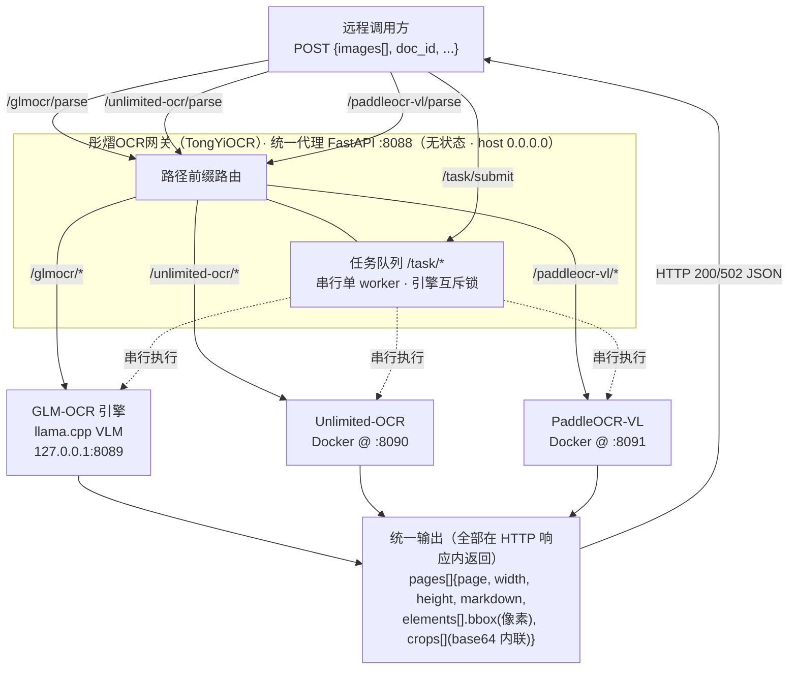

# 彤熠OCR网关 (TongYiOCR)

> 统一多引擎 OCR 代理：聚合 **GLM-OCR** / **Unlimited-OCR** / **PaddleOCR-VL** 三大引擎，输出一致化的 **Markdown + 结构化元素 + 裁剪图**，让调用方只需面对一套接口。

[](LICENSE)
[](https://www.python.org)
[](https://github.com/jianzengliang/TongYiOCR/actions/workflows/ci.yml)

English: TongYiOCR is a unified, stateless OCR gateway that routes requests to multiple OCR back-ends (GLM-OCR, Unlimited-OCR, PaddleOCR-VL) and normalizes their outputs into a single schema.

---

## 特性

- **三引擎统一抽象**：一套 `/parse` 接口 + 一套统一响应结构，屏蔽不同引擎的入参 / 出参差异。
- **无状态代理**：代理本身不持久化任何用户数据；裁剪图以 base64 内联返回，结果全部在 HTTP 响应内。
- **统一输出结构**：`pages[{page, width, height, markdown, elements[], crops[]}]`，`bbox` 均为**像素坐标**（基于原图尺寸），调用方无需再做归一化换算。
- **异步任务队列**：显存只够同时跑一个引擎时，提供串行单 worker + 引擎互斥锁的排队方案，支持进度查询 / 取消 / 单页降级。
- **可插拔引擎**：新增引擎只需实现一个 `*_client.py` 并接入配置，对外契约不变。
- **内置测试台**：访问 `/` 即可打开可视化测试页，支持：实时请求日志（SSE 流）、按健康状态自动过滤的引擎下拉、Markdown 结构化预览、**排版还原**（白底上按 bbox 叠加还原版面，原图可勾选对照）。

---

## 架构



---

## 仓库结构

```
TongYiOCR/
├── app/                        # 统一代理（FastAPI 服务，监听 :8088）
│   ├── main.py                 # 路由注册、CORS、访问日志、lifespan 启动任务队列
│   ├── config.py               # 全部配置（环境变量 / .env 覆盖）
│   ├── schemas.py              # 统一请求 / 响应数据模型
│   ├── task_queue.py           # 异步任务队列（串行单 worker + 引擎互斥锁）
│   ├── glmocr_client.py        # GLM-OCR 引擎客户端（llama.cpp VLM）
│   ├── unlimited_ocr_client.py # Unlimited-OCR 引擎客户端（Docker）
│   └── paddleocr_vl_client.py  # PaddleOCR-VL 引擎客户端（Docker）
├── engine_server.py            # PaddleOCR-VL 引擎服务（容器内 :8091 + 配套 vLLM）
├── docker/
│   └── entrypoint.sh           # 引擎容器启动脚本（先起 vLLM，再起引擎）
├── Dockerfile                  # PaddleOCR-VL 引擎镜像
├── docker-compose.yml          # 两个 Docker 引擎（Unlimited-OCR :8090 / PaddleOCR-VL :8091）
├── docker-compose.gpu.yml      # 单 GPU 容器编排（PaddleOCR-VL 引擎 + vLLM）
├── static/index.html           # 内置测试台（/ 路由）
├── docs/layout-reconstruction-guide.md  # 排版还原参考实现（数据契约 + 前端渲染算法 + 踩坑清单）
├── tests/
│   ├── test_proxy.py           # 接口冒烟测试（离线可跑）
│   └── k12_sample.png          # 样例图
├── examples/client_example.py  # 调用示例（同步 / 异步）
├── requirements.txt            # 代理依赖
├── requirements.glmocr.txt     # GLM-OCR 引擎客户端依赖（可选）
├── requirements.engine.txt     # PaddleOCR-VL 引擎依赖（参考 / 非 Docker 用）
├── pyproject.toml              # 项目元数据与依赖
├── run.py                      # 启动入口（加载 .env + uvicorn）
├── start.sh / start.bat        # 一键启动（自动激活 .venv）
├── .env.example                # 配置示例
├── LICENSE / CONTRIBUTING.md / SECURITY.md
└── Makefile
```

> 说明：本仓库同时包含「统一代理」与「PaddleOCR-VL 引擎」两部分代码。GLM-OCR、Unlimited-OCR 的引擎运行在仓库之外（宿主机 / 其它容器），代理只做转发。

---

## 快速开始

```bash
# 1) 准备虚拟环境并安装代理依赖
python -m venv --system-site-packages .venv
source .venv/Scripts/activate            # Windows
# source .venv/bin/activate              # Linux / macOS
pip install -r requirements.txt

# 2) 复制配置（按需修改）
cp .env.example .env

# 3) 启动代理（默认监听 0.0.0.0:8088）
python run.py
# 或开发模式： uvicorn app.main:app --reload --port 8088

# 4) 打开浏览器访问 http://127.0.0.1:8088 使用内置测试台
```

启动后访问 `/docs` 可查看自动生成的 Swagger 接口文档。

> ⚠️ 代理依赖 `glmocr` SDK 仅在使用 GLM-OCR 时需要（会引入 torch 等较大依赖）。
> 未安装时，`/glmocr/*` 路由会返回明确错误，不影响其它引擎。如需 GLM-OCR：
> `pip install -r requirements.glmocr.txt`

---

## 三引擎部署

代理是**纯转发**：每个引擎需独立启动，代理按路径前缀把请求路由过去。

### 1) GLM-OCR（宿主机，llama.cpp VLM :8089）

```bash
# 先启动 GLM-OCR 的 llama.cpp VLM 端点（监听 127.0.0.1:8089）
llama-server -m models/GLM-OCR-Q8_0.gguf --mmproj models/mmproj-GLM-OCR-Q8_0.gguf \
    -c 128000 -ngl -1 --host 127.0.0.1 --port 8089 -np 1 --temp 0.1
```

### 2) Unlimited-OCR（Docker :8090）

```bash
# 构建 / 拉取 unlimited-ocr 镜像后：
docker run -d --name unlimited-ocr -p 8090:8000 --gpus all unlimited-ocr:latest
```

### 3) PaddleOCR-VL（Docker :8091，引擎 + 配套 vLLM）

```bash
# 单 GPU 容器编排（推荐）：同时起 vLLM(:8118) 与本引擎(:8091)
docker compose -f docker-compose.gpu.yml up -d

# 或仅起引擎容器（vLLM 由镜像内 entrypoint 自启）
docker compose up -d
```

> 部署注意：在 Docker Desktop on Windows 等环境下，容器发布端口可能只绑定 IPv6（`::1`）。
> 若代理与引擎容器同宿主且转发失败，请按实际网络填写 `UNLIMITED_OCR_URL` / `PADDLEOCR_VL_URL`（如 `http://[::1]:8090`）。

---

## 配置

所有配置均可由环境变量或 `.env` 覆盖（见 `.env.example`）。

**服务自身**

| 变量 | 默认 | 说明 |
|------|------|------|
| `HOST` / `PORT` | `0.0.0.0` / `8088` | 代理监听地址 / 端口 |
| `WORKERS` | `1` | uvicorn worker 数 |
| `REQUEST_TIMEOUT` | `600` | **单页**级超时（秒）。生产环境大批量解析建议设为 `180`（见 `.env.example`），避免单页卡死拖垮整批 |

**GLM-OCR**（llama.cpp VLM，本机 `:8089`）

| 变量 | 默认 | 说明 |
|------|------|------|
| `GLM_OCR_ENABLED` | `1` | 是否启用 |
| `GLM_OCR_API_HOST` / `GLM_OCR_API_PORT` | `127.0.0.1` / `8089` | 引擎地址 |
| `GLM_OCR_LAYOUT_DEVICE` | `cuda` | PP-DocLayoutV3 运行设备 |
| `GLM_OCR_LAYOUT_MODEL_DIR` | 空 | 本地 PP-DocLayoutV3 模型目录（离线必备） |

**Unlimited-OCR**（Docker 容器，默认 `:8090`）

| 变量 | 默认 | 说明 |
|------|------|------|
| `UNLIMITED_OCR_ENABLED` | `1` | 是否启用 |
| `UNLIMITED_OCR_URL` | `http://localhost:8090` | 容器地址 |
| `UNLIMITED_OCR_PARSE_PATH` | `/v1/ocr/multi` | 解析端点 |
| `UNLIMITED_OCR_HEALTH_PATH` | `/health` | 健康检查端点 |
| `UNLIMITED_OCR_PROMPT` | 见 `config.py` | 识别指令 |

**PaddleOCR-VL**（Docker 容器，默认 `:8091`）

| 变量 | 默认 | 说明 |
|------|------|------|
| `PADDLEOCR_VL_ENABLED` | `1` | 是否启用 |
| `PADDLEOCR_VL_URL` | `http://localhost:8091` | 容器地址 |
| `PADDLEOCR_VL_PARSE_PATH` | `/parse` | 解析端点 |
| `PADDLEOCR_VL_HEALTH_PATH` | `/health` | 健康检查端点 |

**任务队列**

| 变量 | 默认 | 说明 |
|------|------|------|
| `MAX_QUEUE_SIZE` | `10` | 队列上限，超出返回 429 |
| `TASK_TIMEOUT` | `3600` | 预留（单任务总超时，当前版本未接入；单页超时由 `REQUEST_TIMEOUT` 控制） |
| `ESTIMATED_TASK_SECONDS` | `900` | 单任务预估耗时，用于估算等待 |
| `OCR_WORKSPACE_DIR` | 空 | base64 解码落盘临时目录（请求完成自动清理） |

---

## 统一输出结构（三引擎一致）

所有 `/parse` 路由与任务队列结果都返回同一套结构：

```jsonc
{
  "ok": true,
  "engine": "glmocr:127.0.0.1:8089",        // 引擎标识；GLM-OCR 才有
  "error": null,
  "pages": [
    {
      "page": 1,
      "width": 900,                          // 页面原始宽(px)
      "height": 1200,                        // 页面原始高(px)
      "markdown": "## 标题\n正文…",          // 完整 Markdown
      "elements": [                          // 结构化元素
        {
          "type": "title",                   // title|subtitle|paragraph|formula|table|figure|header|footer
          "bbox": [61, 44, 406, 77],         // [x1,y1,x2,y2] 像素坐标（原始页面尺寸，左上角原点）
          "content": "第3课 小数的加减法",
          "confidence": 0.98,                // 置信度 0-1（部分引擎为 null）
          "latex": null,                     // formula 类型的 LaTeX
          "html": null,                      // table 类型的 HTML
          "caption": null                    // figure 类型的说明
        }
      ],
      "crops": [                             // 裁剪图（base64 内联，PNG）
        {
          "filename": "doc_page1_type0.png",
          "base64": "data:image/png;base64,iVBORw0…",
          "element_index": 0,                  // ★ 对应 elements[] 的下标（figure 还原用）
          "bbox": [61, 44, 406, 77]            // 与对应元素 bbox 一致（兜底匹配用）
        }
      ]
    }
  ],
  "json_result": [ /* GLM-OCR 额外保留的原始 json_result（仅 GLM-OCR 返回） */ ]
}
```

- **坐标系统**：`bbox = [x1, y1, x2, y2]`，像素，基于页面原始尺寸，左上角为原点。
- **crops 来源**：优先用引擎原生裁剪图；当原生不可用（如 GLM-OCR selfhosted 下 `image_files` 为 None）时，按元素 bbox 从原图裁出，与 `elements` 一一对应。
- **crops 元数据**：每个 crop 都带 `element_index`（指向 `elements[]` 的下标）与 `bbox`（与对应元素 bbox 一致）。这两个字段供前端把裁剪图对回版面位置——尤其是 `figure` 类几何图 / 插图，`element_index` 用于精确匹配，bbox 用于引擎未返回下标时的 IoU 模糊兜底匹配。
- **GLM-OCR** 在统一结构之外，额外保留 `json_result` 原文（SDK 原始输出），便于调用方做高级处理。

---

## 路由总览

| 路径 | 方法 | 说明 | 后端 |
|------|------|------|------|
| `/health` | GET | 聚合三引擎状态 | — |
| `/glmocr/health` | GET | GLM-OCR 可用 + llama.cpp 端口 | llama.cpp 8089 |
| `/glmocr/parse` | POST | base64 图片 → 统一 Markdown + elements + crops | llama.cpp 8089 |
| `/unlimited-ocr/health` | GET | Unlimited-OCR 容器状态 | Docker 8090 |
| `/unlimited-ocr/parse` | POST | base64 图片 + prompt → 统一输出 | Docker 8090 |
| `/paddleocr-vl/health` | GET | PaddleOCR-VL 容器状态 | Docker 8091 |
| `/paddleocr-vl/parse` | POST | 图片 + task_type/language → 统一输出 | Docker 8091 |
| `/task/submit` | POST | 提交异步任务（返回 task_id） | — |
| `*/parse_pdf` | POST | PDF 文件（multipart）→ 逐页转图 → 引擎解析，返回统一输出 | 对应引擎 |
| `/task/submit_pdf` | POST | PDF 文件（multipart）→ 逐页转图后作为多页任务提交队列 | — |
| `/task/{id}/status` | GET | 查询状态 / 进度 | — |
| `/task/{id}/result` | GET | 获取结果（completed/failed 才可用） | — |
| `/task/{id}/cancel` | POST | 取消任务 | — |
| `/task/queue/info` | GET | 队列概览 | — |
| `/` | GET | 内置测试台（static/index.html） | — |

### 接口契约

**GLM-OCR**
```
POST /glmocr/parse
{ "images": ["data:image/png;base64,..."],   // base64 data URI 列表
  "image_paths": ["/abs/path.png"],           // 也可传本地路径（兼容旧格式，二选一）
  "doc_id": "x",
  "llama_host": "127.0.0.1",                  // 可选：覆盖引擎 host
  "llama_port": 8089,                         // 可选：覆盖引擎 port
  "save_dir": null }                          // 已废弃（无状态不落盘），忽略
→ 统一 OCRParseResponse（含 json_result）
```
- 经 glmocr SDK（selfhosted）转发到 llama.cpp 的 VLM；SDK 内部用 PP-DocLayoutV3 做版面辅助。
- 本机无外网时，通过 `GLM_OCR_LAYOUT_MODEL_DIR` 指向本地 PP-DocLayoutV3 快照，绕开 HuggingFace 联网。
- **前置**：先起 llama.cpp GLM-OCR 引擎（监听 127.0.0.1:8089）。

**Unlimited-OCR**
```
POST /unlimited-ocr/parse
{ "images": ["data:image/png;base64,..."],   // base64 data URI（支持裸 base64 与 data URI）
  "prompt": "识别图中所有文字…以 Markdown 返回",
  "doc_id": "x" }
→ 统一 OCRParseResponse（crops 由 bbox 派生）
```
- 真实端点容器内为 `/v1/ocr/multi`（`enable_grounding=true` 返回 bbox）。
- **坐标归一化**：Unlimited-OCR 返回的 bbox 是**归一化坐标（0~1000）**，与真实像素尺寸不符。后端 `_detect_and_scale_coords()` 会自动检测（任一坐标越界即判定）并缩放到像素坐标后再生成 crops，无需前端换算。若裁剪图仍错位，请检查该步是否生效。
- **文本后处理**：引擎偶发把同一区域重复输出、或吐出原始 `\(...\)` LaTeX 与控制字符，后端 `_dedup_elements()` / `_clean_latex()` 会做去重与清洗。
- **前置**：先起 Unlimited-OCR Docker 容器（默认映射 8090）。

**PaddleOCR-VL**
```
POST /paddleocr-vl/parse
{ "images": [ {"page":1,"image_data":"data:image/png;base64,..."} ],
  "task_type": "general",   // general | table | formula | layout
  "language": "ch",         // ch | en | ...
  "doc_id": "x" }
→ 统一 OCRParseResponse（text_blocks 映射为 elements）
```
- **前置**：先起 PaddleOCR-VL Docker 容器（默认映射 8091）。

---

## 任务队列

显存只够同时跑一个引擎，故采用**串行单 worker + engine_lock** 排队。

```
POST /task/submit
{ "engine": "glmocr",                       // glmocr | unlimited-ocr | paddleocr-vl
  "images": ["data:image/png;base64,..."],
  "doc_id": "x",
  "llama_port": 8089,                        // GLM-OCR 可选
  "prompt": "...",                           // Unlimited-OCR 可选
  "task_type": "general", "language": "ch" } // PaddleOCR-VL 可选
→ { "task_id": "uuid", "status": "queued", "position": 1, "estimated_wait_seconds": 900 }

GET  /task/{id}/status   → { status, progress, current_page, total_pages, position, error, ... }
GET  /task/{id}/result   → 统一 TaskResultResponse（pages + total_pages + page_errors），未完成返回 400
POST /task/{id}/cancel   → { task_id, status }（queued/processing 时可取消）
GET  /task/queue/info    → { queue_size, current_task_id, total_tasks, completed_tasks, failed_tasks }
```

状态机：`queued → loading → processing → completed | failed | cancelled`。轮询 `status` 即可获取进度（单页级别 `current_page` / `progress`）。

> **单页降级**：逐页调用引擎，单页超时 / 引擎报错只记入 `page_errors[页码]` 并跳过继续，已成功页保留，整批仍标记为 `completed`。`page_errors` 经 `/task/{id}/result` 返回，调用方可据此重试失败页。因此 200 页十几分钟的串行解析属正常行为，不会因个别慢页而整批失败。

---

## 内置测试台（访问 `/`）

代理根路径 `/` 提供一个零依赖的可视化测试页（`static/index.html`），用于快速试解析与验证还原效果。主要功能：

- **引擎下拉按健康过滤**：下拉只列出健康检查（`/xxx/health`）确认可用的引擎；不可用的自动隐藏。需先确认对应引擎已启动（见上文部署）。
- **PDF 上传**：文件选择支持图片与 PDF（`.pdf`）。选 PDF 时，后端用 pymupdf 把每页转成图片（OCR 用 200 DPI、背景用 110 DPI），再逐页送引擎解析；「同步解析」走 `*/parse_pdf`、「提交任务」走 `/task/submit_pdf`。多页 PDF 每页各自带 `page_image` 作为「排版还原」背景（超过 20 页则不内联背景图以控制报文体积，退回仅还原层）。
- **实时请求日志**：通过 SSE 流（`GET /logs/stream`）实时展示代理收到的请求（时间、方法、路径、状态码、耗时、来源 IP）；时间为**北京时间（UTC+8）**；支持暂停 / 清空 / 自动滚动。
- **Markdown 结构化预览**：解析返回的 Markdown 做轻量结构化渲染（标题 / 列表 / 表格 / 代码块），纵向滚动、按内容换行；响应报文预览中的大图 base64 会自动截断显示，避免浏览器卡死。**公式在 Markdown 视图以原始 `$...$` 源码显示**（数学样式渲染见「排版还原」视图），以忠实呈现引擎返回的文本。
- **排版还原（Layout Reconstruction）**：在白底上按 `elements[].bbox` 绝对定位叠加出还原版面（文字 / 表格 / **公式** / 几何图），并通过 `crops[].element_index` 把 figure 裁剪图对回对应位置。公式渲染分两类：① 段落 / 标题 / 选项等**文字框内嵌的行内 `$...$` / `$$...$$` 公式**（Unlimited-OCR 真实返回的主要形态，LaTeX 字段为 `null`、公式直接写进 `content`）会被 `renderInlineLatex()` 就地渲染为数学样式；② 独立的 `formula` 类型元素（如 PaddleOCR-VL 返回）走 `renderLatex()` 渲染其 `latex`/`content`，若二者皆空则回退显示该区域原图裁切或标注「（公式未识别）」。所有公式渲染均为**纯前端离线 LaTeX 子集**（无 MathJax/KaTeX、无网络请求）。
  - **默认显示还原层**（白底 + 蓝色边框勾勒结构），原图底图默认隐藏。
  - 勾选 **「显示原图」** 才把原图叠加到底层做对照；勾选 **「显示边框」** 控制 bbox 描边显隐。
  - 缩放用 CSS `transform: scale`（10%~300%），不影响百分比布局基准，零重排。
  - 详细的数据契约、坐标处理与前端渲染算法见 [`docs/layout-reconstruction-guide.md`](docs/layout-reconstruction-guide.md)。
- **裁剪图诊断（Crops）**：每页额外提供 **「裁剪图」** tab，把 `crops[]` 中**每一张识别后从原图裁出的小图**网格陈列，并标注 `#序号` / `type` / 裁图尺寸，点击可开大图。用于快速核对"识别后的裁剪原图到底长什么样、有没有裁错 / 越界 / 空白"。这是排查坐标错位（见下）的最快手段。

> 前端为纯静态文件，改动刷新即生效；代理主程序（`app/main.py` 等）改动需重启 8088。

---

## 测试与开发

```bash
# 安装开发依赖
pip install pytest httpx

# 运行接口冒烟测试（不需要任何 OCR 引擎，离线可跑）
pytest

# 代码风格
pip install ruff
ruff check app tests
```

更多开发命令见 [`Makefile`](Makefile)（`make help`）。

---

## 贡献

欢迎 Issue / PR！请先阅读 [CONTRIBUTING.md](CONTRIBUTING.md)。

## 许可证

[MIT](LICENSE) © 2026 jianzengliang
